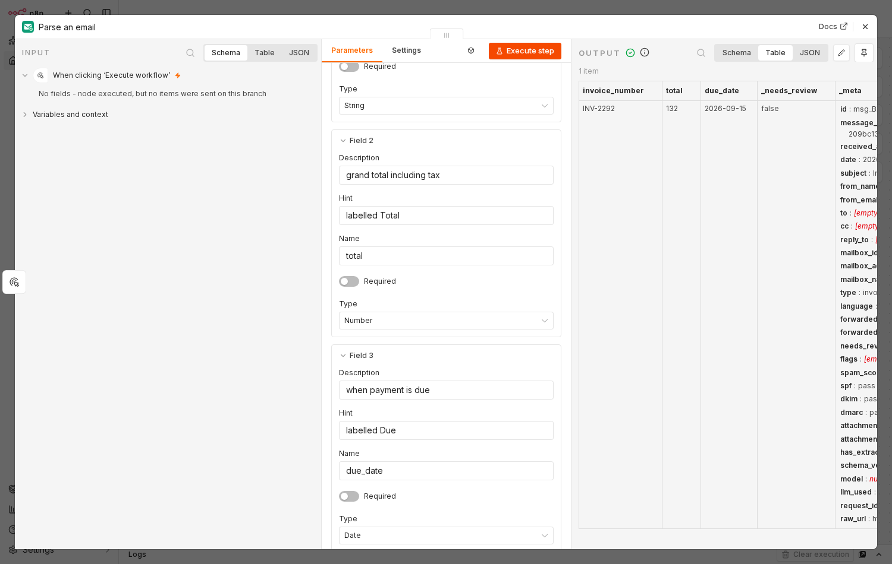

# MailMint

**Send an email to an address you were given. Get it back as structured JSON — with a
real SPF, DKIM and DMARC verdict on the message.**

Not "we scraped the body with a regex": MailMint runs its own inbound SMTP server, so
it sees the envelope and the raw RFC822 bytes, and can verify the DKIM signature over
the body it actually received. Every parse result carries
`auth: { spf, dkim, dmarc, spam_score }`, and when a check cannot be evaluated it says
`none` rather than guessing.



## Try it in three ways

**As an API — nothing to install, nothing stored:**

```bash
curl -X POST https://mailmint.app.mintapis.com/v1/parse \
  -H "Authorization: Bearer $MAILMINT_KEY" -H 'content-type: application/json' \
  -d '{"subject":"Invoice INV-7781","text":"Amount due: 1,284.00 EUR\nDue date: 2026-09-30",
       "schema":[{"name":"amount_due","type":"number","description":"Total amount due"}]}'
```

**As an inbound address:** sign up at
[mailmint.app.mintapis.com](https://mailmint.app.mintapis.com), and the address on your
dashboard is live immediately. Mail sent to it is received, authenticated and parsed.

**In n8n:** `npm i n8n-nodes-mailmint` in `~/.n8n/nodes`, or *Settings → Community Nodes*.
There is a finished workflow to import rather than build —
[Screen invoice emails and hold the doubtful ones for review](https://mailmint.app.mintapis.com/n8n#templates),
twelve annotated nodes with both failure paths wired.

## Honest status, 2026-08-30

**Live, and a stranger can use it.** Every row below was checked on 2026-08-30, not recalled.

| Piece | State |
| --- | --- |
| Hosted service | **https://mailmint.app.mintapis.com** — sign up, no card, no confirmation mail |
| Public inbound address | **Yes.** `mx.smooth-operator.online` points at the server; an invoice mailed to a fresh account's address came back parsed, with its SPF/DKIM/DMARC verdicts |
| `packages/api` — REST API, webhooks, dashboard | Live. `POST /v1/parse` takes a message you already have and stores nothing |
| `packages/smtpd` — inbound SMTP server | Live on port 25 with STARTTLS; sees the envelope and the raw RFC822 bytes |
| `packages/parser` — RFC822 → canonical JSON | Complete against the contract, tested |
| `packages/n8n-node` — `n8n-nodes-mailmint` | **Published: `npm i n8n-nodes-mailmint`**, zero runtime dependencies, npm provenance attestation |
| Billing | Live. Free is 300 parsed emails a month; Starter $9, Pro $29, Scale $99 through Stripe Checkout |
| SMTP TLS certificate | **Still self-signed.** Sending servers using opportunistic STARTTLS deliver anyway; one enforcing strict TLS would refuse |
| n8n verification | **Not yet.** The node is in n8n's manual review, so n8n Cloud cannot install it; self-hosted n8n can |
| Paying customers | **None.** Nobody outside this project has paid, and no number here will pretend otherwise |

Two things follow from that table and are worth saying out loud: the parts a stranger
touches — signup, an address, a parse, a webhook, a card — all work today; and the two
things that do not are a TLS certificate and somebody else's review queue.

## What the JSON looks like

Every path — webhook body, `GET /v1/messages/:id`, the n8n node's output — returns the
same shape. `docs/CONTRACT.md` is the frozen definition and the thing every package is
written against.

```jsonc
{
  "id": "msg_01JQ8Z3K4M5N6P7Q8R9S",
  "mailbox": { "address": "k7m2xq4h9bwz@parse.example.com", "name": "Invoices" },
  "received_at": "2026-08-25T09:14:03.221Z",
  "envelope": { "from": "billing@acme.com", "to": ["k7m2xq4h9bwz@parse.example.com"] },
  "auth":  { "spf": "pass", "dkim": "pass", "dmarc": "pass", "spam_score": 0.4 },
  "tables":   [ { "source": "html", "headers": ["Item","Qty","Amount"],
                  "records": [ { "Item": "Widget", "Qty": "3", "Amount": "$27.00" } ] } ],
  "detected": { "type": "invoice", "amounts": [ { "value": 31.50, "currency": "USD" } ] }
}
```

Three layers, deliberately separated: the envelope and authentication are facts from the
protocol; `tables` and `detected` are deterministic extraction from the body; anything
schema-driven on top is labelled and carries confidence flags. **A flagged message is
still delivered** — `needs_review` goes true, nothing is silently dropped.

## Layout

Monorepo, npm workspaces.

```
packages/parser/     pure library — RFC822 to the canonical JSON above
packages/smtpd/      the inbound SMTP server; zero runtime dependencies
packages/api/        REST API, webhook delivery, dashboard (Express + Postgres)
packages/intake/     IMAP polling and provider connectors, for hosts that own the MX
packages/docs/       attachment extraction — PDF text and tables, OCR
packages/n8n-node/   published separately as n8n-nodes-mailmint, zero runtime deps
docs/CONTRACT.md     the frozen contract. Read this before changing anything
ops/                 what it created, what it costs, and how to tear it down
```

## Running it

```bash
npm install
npm test -w packages/parser
npm test -w packages/smtpd
```

`docs/CONTRACT.md` is the single source of truth. `docs/COMPETITORS.md` is the honest
comparison against the parsers that already exist, written before this one was built.

## Related

- [PDFMint](https://github.com/fstandhartinger/pdfmint) — HTML, Markdown or a URL to PDF.
- [DocMint](https://github.com/fstandhartinger/docmint) — fill Word, Excel and
  PowerPoint templates from JSON.

Run by one person. Issues are read.
